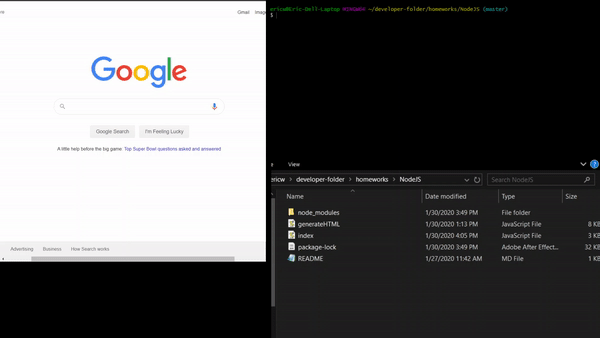

# NodeJS
NodeJS is a project that takes a user's Github account username and their information within their account via: followers, following, bio just to name a few things and converting it to a HTML file. With the HTML file, it is converted to an PDF.
 

# How to get started
<ol>
  <li>Make sure you are in the right directory, if you are not in the javascript folder before running it. It will throw an error</li>
  <li>Once you are in the right directory, make sure the NPM packages are installed.</li>
  <li>To install the packages need is (NPM install inquirer fs-extra util axios puppeteer) After those have been installed, you are ready to execute the program!</li>
  <li>Executing the program is node index.js in the terminal </li>
  <li>Enter Github username and choose a color</li>
  <li>A HTML file will be created and shortly after the PDF version</li>
  <li>Done!</li>
  
# Credit
W3Schools, various youtube videos, and in-class activites help with the write up of the await and async functions
https://www.youtube.com/watch?v=9VgghGKx_1c&t=2s helped with converting the HTML file to PDF

# Usage
The code is free to use and rewrite
